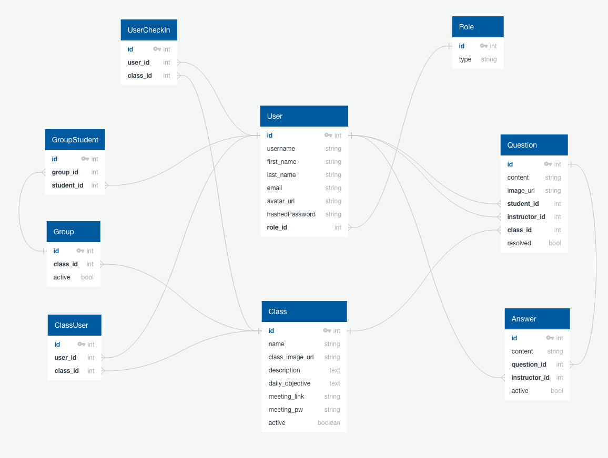

# Schema
## Tables
* Role
  * Stores different roles to be applied to users
* User
  * Stores unique user information for authorization and authentication
* Class(room)
  * stores information relevant to individual classrooms
* Queston
  * stores informaiton on questions asked by students
* Answer
  * stores information on answers provided by instructors
* Group
  * stores current and historical group data for specific classrooms
* Class_User (Join_Table)
  * connects classrooms and users in a many to many relationship
* Group_Student (Join_table)
  * connects students to groups in a many to many relationship
* User_Checkin (Join_Table)
  * connects students to classrooms and exists to mark a check-in
----

> ## Role

| Column | Data Type | Nullable | Unique | Key | Default |
|--------|-----------|----------|--------|-----|---------|
| id | integer | F | T | Primary | serial |
| type | string | F | T | No | N/A |
| updatedAt | datetype | F | F | No | new Date() |
| createdAt | datetype | F | F | No | new Date() |

 

> ## User

| Column | Data Type | Nullable | Unique | Key | Default |
|--------|-----------|----------|--------|-----|---------|
| id | integer | F | T | Primary | serial |
| username | string | T | F | No | Null |
| first_name | string | F | F | No | N/A |
| last_name | string | F | F | No | N/A |
| email | string | F | T | No | N/A |
| avatar_url | text | T | F | No | N/A |
| hashed_password | string | F | F | No | N/A |
| updatedAt | datetype | F | F | No | new Date() |
| createdAt | datetype | F | F | No | new Date() |

 

> ## Class(room)
| Column | Data Type | Nullable | Unique | Key | Default |
|--------|-----------|----------|--------|-----|---------|
| id | integer | F | T | Primary | serial |
| name | string | F | T | No | N/A |
| class_img_url | text | T | F | No | N/A |
| description | text | F | F | No | N/A |
| daily_objective | text | T | F | No | N/A |
| meeting_link | string | T | F | No | N/A |
| meeting_pw | string | T | F | No | N/A |
| active | boolean | F | F | No | True |
| updatedAt | datetype | F | F | No | new Date() |
| createdAt | datetype | F | F | No | new Date() |

 

> ## Question
| Column | Data Type | Nullable | Unique | Key | Default |
|--------|-----------|----------|--------|-----|---------|
| id | integer | F | T | Primary | serial |
| content | text | F | F | No | N/A |
| image_url | text | T | F | No | N/A |
| student_id | integer | F | F | Foreign(User.id) | N/A |
| instructor_id | integer | T | F | Foreign(User.id) | N/A |
| class_id | integer | F | F | Foreign(User.id) | N/A |
| resolved | boolean | F | F | No | False |
| updatedAt | datetype | F | F | No | new Date() |
| createdAt | datetype | F | F | No | new Date() |

 

> ## Answer
| Column | Data Type | Nullable | Unique | Key | Default |
|--------|-----------|----------|--------|-----|---------|
| id | integer | F | T | Primary | serial |
| contnet | text | T | F | No | N/A |
| question_id | integer | F | F | Foreign(Question.id) | N/A |
| instructor_id | integer | F | F | Foreign(Question.id) | N/A |
| class_id | integer | F | F | Foreign(Class(room).id) | N/A |
| resolved | boolean | F | F | No | False |
| updatedAt | datetype | F | F | No | new Date() |
| createdAt | datetype | F | F | No | new Date() |

 

> ## Group
| Column | Data Type | Nullable | Unique | Key | Default |
|--------|-----------|----------|--------|-----|---------|
| id | integer | F | T | Primary | serial |
| class_id | integer | F | F | Foreign(Class(room).id) | N/A |
| active | boolean | F | F | No | True |
| updatedAt | datetype | F | F | No | new Date() |
| createdAt | datetype | F | F | No | new Date() |

 

> ## Class_User
| Column | Data Type | Nullable | Unique | Key | Default |
|--------|-----------|----------|--------|-----|---------|
| id | integer | F | T | Primary | serial |
| user_id | integer | F | F | Foreign(User.id) | N/A |
| class_id | integer | F | F | Foreign(Class(room).id) | N/A |
| updatedAt | datetype | F | F | No | new Date() |
| createdAt | datetype | F | F | No | new Date() |

 

> ## Group_Student
| Column | Data Type | Nullable | Unique | Key | Default |
|--------|-----------|----------|--------|-----|---------|
| id | integer | F | T | Primary | serial |
| group_id | integer | F | F | Foreign(Group.id) | N/A |
| student_id | integer | F | F | Foreign(User.id) | N/A |
| updatedAt | datetype | F | F | No | new Date() |
| createdAt | datetype | F | F | No | new Date() |

 

> ## User_Checkin
| Column | Data Type | Nullable | Unique | Key | Default |
|--------|-----------|----------|--------|-----|---------|
| id | integer | F | T | Primary | serial |
| user_id | integer | F | F | Foreign(User.id) | N/A |
| class_id | integer | F | F | Foreign(Class(room).id) | N/A |
| updatedAt | datetype | F | F | No | new Date() |
| createdAt | datetype | F | F | No | new Date() |

 
