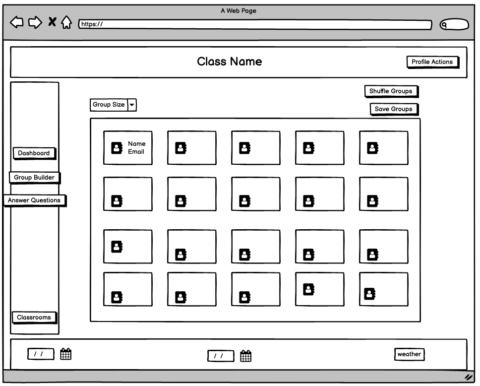
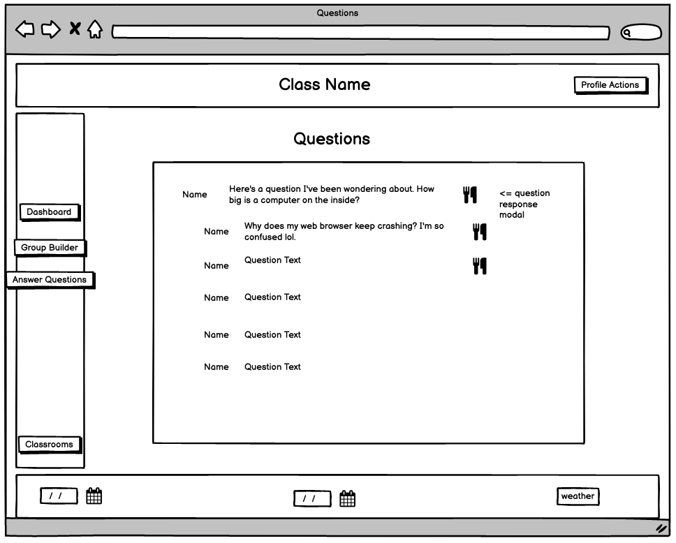
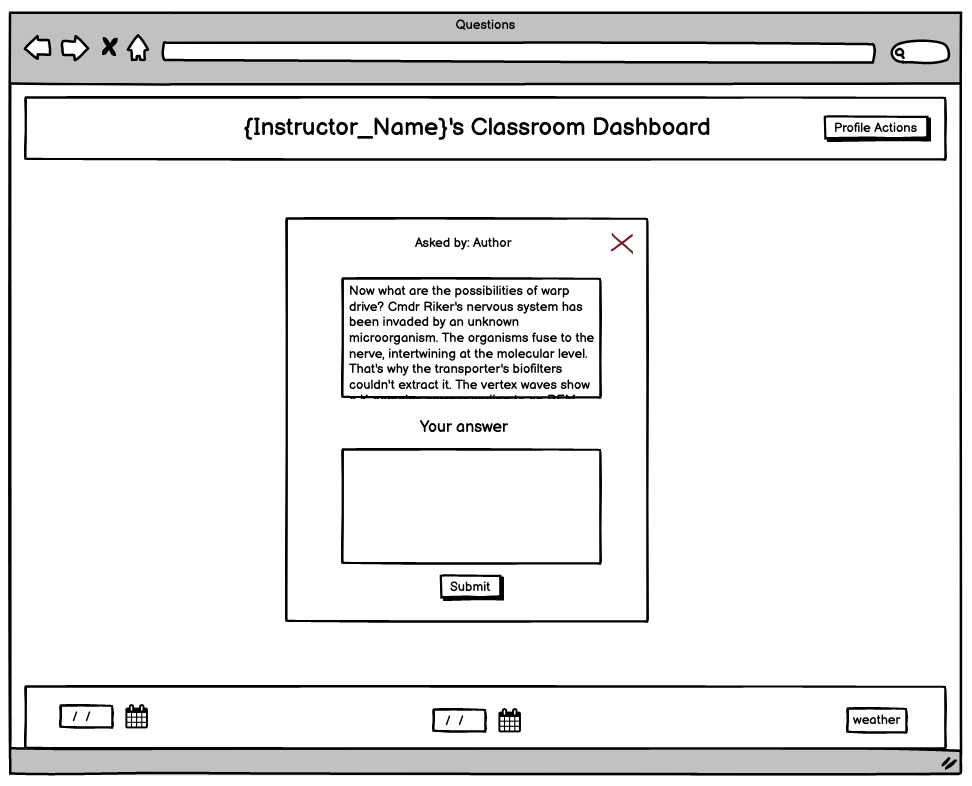
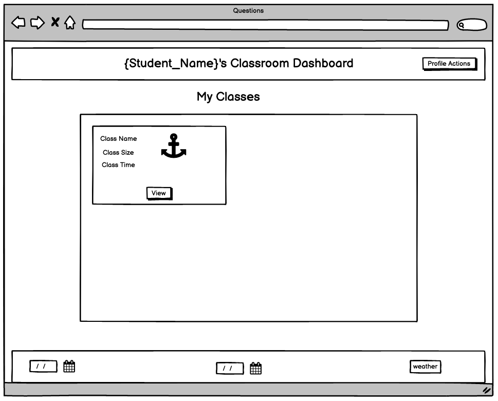
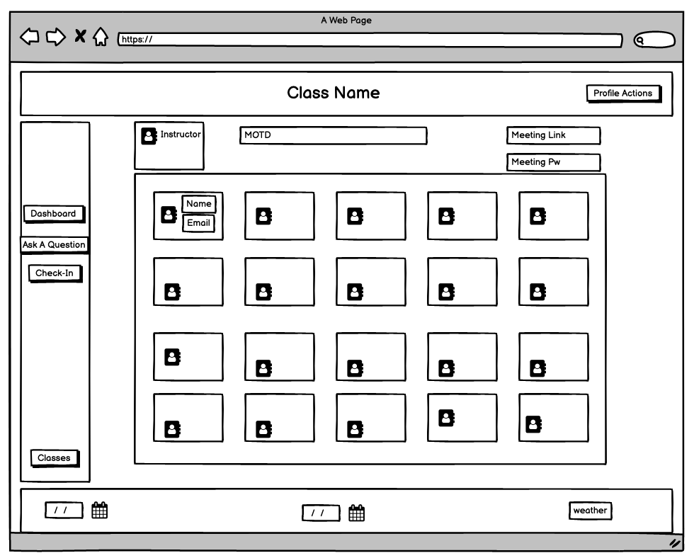
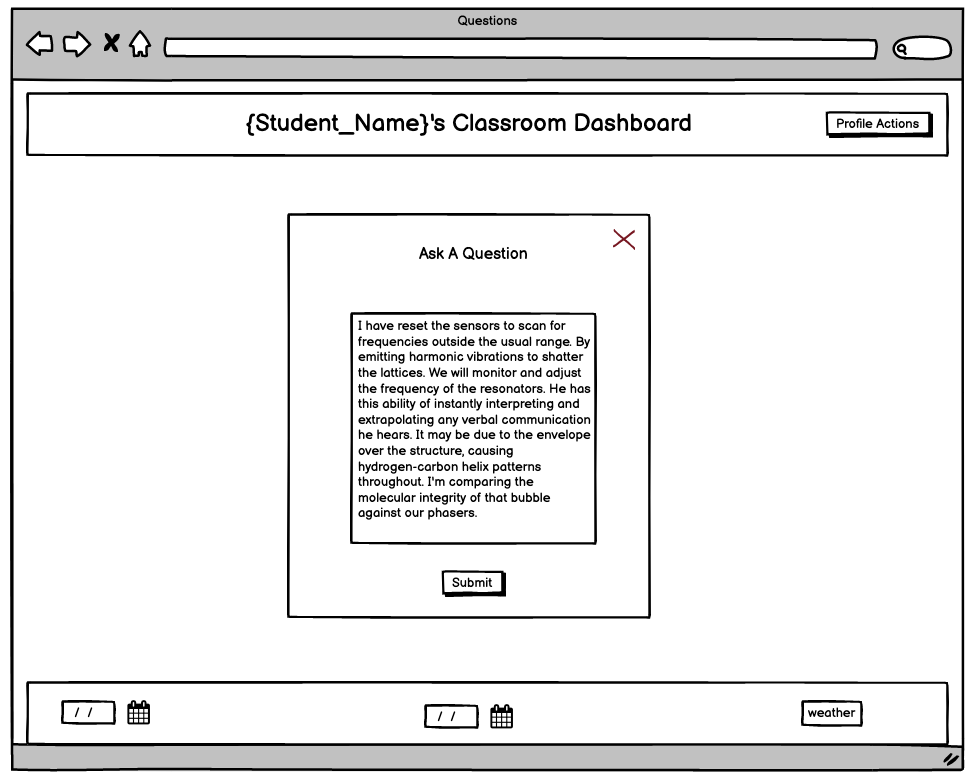
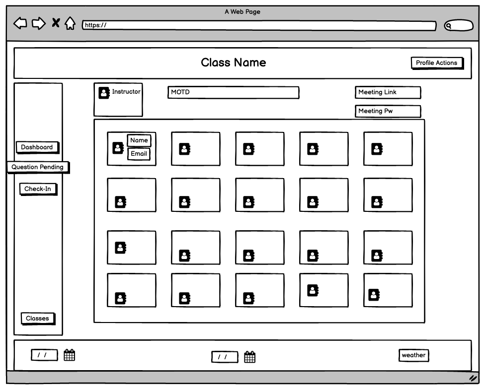
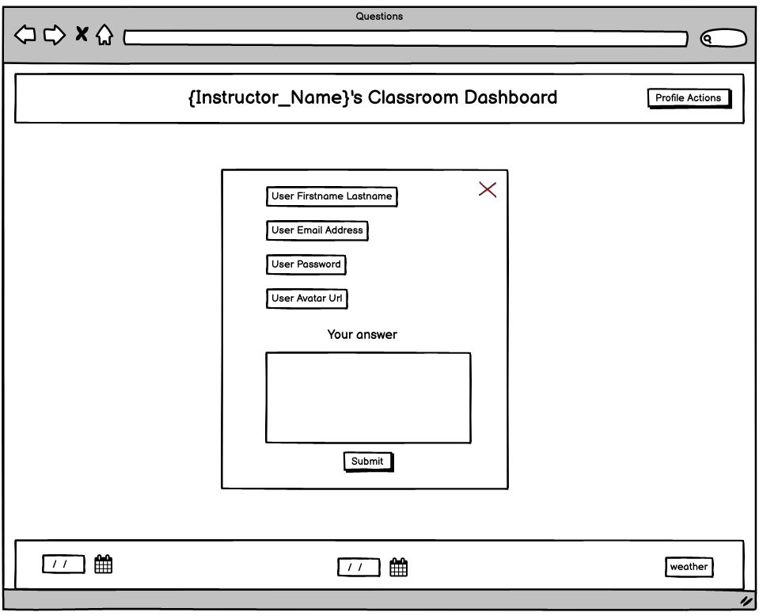

# Wireframes

> ## Instructor Landing / Class Selection

 

> ## Instructor Dashboard

 

> ## Instructor Group Builder!!!!!!!!!!!

 

> ## Instructor Question Interface

 

> ## Student Class Select / Landing

 

> ## Student Dashboard

 

> ## Student Questions Modal

## Question Pending

 

> ## Profile View !!!!!!!!!!!!

